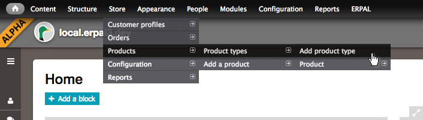
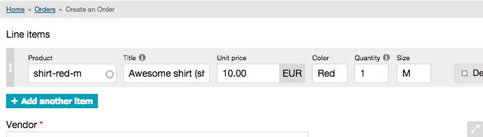

As our main goal with ERPAL Platform is [to provide a flexible business application solution](introduction/about_erpal.md) build with Drupal, there is a pretty good chance that you would want to customize products to fit your needs. Therefore we want show you how to create custom product- and line-item-types, and how you can add these new options to the line-items.

For our example, let's say we have a t-shirt-shop and we want to setup a product-type that gives us the option to specify the color and size of the shirts that we are shipping.

## 1. Create a product-type
Let's dive right in and create a new product type for our t-shirts.

1. Navigate to: Store » Products » Product types » Add product type
1. Insert a name for your product-type e.g. "T-Shirt"
1. Click the "Save and add fields"-Button at very the end of the form
1. Add two new text-fields named "Color" and "Size"
    - it will be beneficial to adjust the field names to `field_shirt_color` and `field_shirt_size`, to prevent any 
    inconveniences in the future
    - you might as well use taxanomy-terms instead of text-fields, but we'll take the easy path for now
1. Save it

## 2. Add line-item-type
Next we will create a new line-item-type so that the new product will eventually appear on an order.

FYI: These fields will be displayed while adding an item to an order, so you might want to adjust the field-sizes to 
fit your liking.

1. Go to: Store » Configuration » Line item types » Add a product line item type
1. Insert a fitting name, we'll again go with "T-Shirt", as the line-item should accompany out new product-type
1. Add the existing fields `field_shirt_color` and `field_shirt_size` (in our case same as with product-type)
1. Save that line-item-type!

## 3. Connect product-type with line-item-type
We got the new product- and line-item-type ready, now we have to connect them both.

1. Navigate to Store » Configuration » Order Settings » Manage fields
1. Edit the "line items" widget-type
1. The widget-type should be set to "Dynamic line item widget"
1. Adjust the "Settings for _T-Shirts_ line item type" (a fieldset within the dynamic line item widget fieldset) 
    1. Select the correct "Product type", in our case - you might have guessed it - "T-Shirt"
    1. Set `commerce_unit_price` to `commerce_price`
    1. Set `field_shirt_color` to `field_shirt_color`
    1. And finally `field_shirt_size` to `field_shirt_size`
1. Hit "Continue" and "Save"

You may want to repeat these steps for your invoices and quotes as well. Their config is located at: Store » 
Configuration » Order types » Invoice / Quote.

## 4. The Final: create a product & check
Finally: check if everything is working as expected.

1. Find your way to: Store » Products » Add a product » Create T-Shirt
   or via the ERPAL Menu "Products" and then the local action (the button on top) "Add a product"
1. As you can see our two new fields are added to the form. Now insert all data.
    Remember the sku-value.
1. Insert the sku into the product-autocomplete-field and select the recently created product
1. Now you should see who the fields adjusted to the different product-type and its fields.

## Summary
So what have we learned today? Adding a custom product is not much more complicated than adding a new content-type to
 a Drupal-site. It is important to create not just the product-type but also a line-item-type and connect them. All 
 in all just 3 small steps.
