Customizing ERPAL Platform is as easy as customizing plain Drupal.
There are however some things you should know before you start.
In this guide we want to give you an example of how you add custom products, customize a view provided by ERPAL and how you can store all of this in a feature.
The process of customizing and exporting of configuration delivered by a module does not only apply for ERPAL Platform but for all modules that serve configurations.
For example line item views served by commerce.

** TL;DR? ** Go read [the summary](#the-summary) ;-)

## The Theory

### Features
To persist your configurations in Drupal you would normally use [the features module](https://www.drupal.org/project/features). 
Many distributions use features to deliver their configuration. 
In this case when you want to customize some of the distributions configurations you would use [features override](https://www.drupal.org/project/features_override).
Since overriding of features can sometimes be quite a challenge we decided to not use features for ERPAL Platform but leave it as a tool for you.
If you want to know more about this you can have a look at [Oskars Session at DrupalCon Barcelona](https://www.youtube.com/watch?v=DbyLNvpl1rs).

### Unlink Defaults
To deliver the configurations for ERPAL Platform we use default hooks in code. 
When you customize a configuration you are by default not able to move store this configuration in a feature.
This is due to the fact that the configuration is already in code somewhere and features won't let you store it in a file again.
To overcome this we created the [unlink default configurations](https://www.drupal.org/project/unlink_defaults) module which lets you move configuration from files to the database.
You are then able to store your customized configuration in a feature.

## The Customizing Process
For this example we want to create a product type T-shirt and customize the view that is listing all products to show the custom fields of the T-shirts.

### The Product
Please follow [step 1 of the custom product instructions](custom-product-lineitem-type.md#1-create-a-product-type) to see how we create a T-shirt product type with a color and a size field.
We add the fields as simple text fields for this demo, but any field type you prefer is suitable.

The final result will look something like this:

[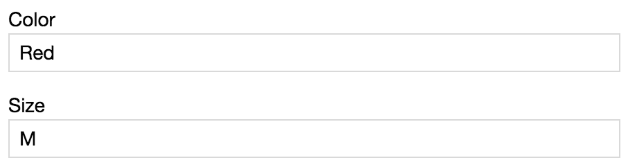](../img/development/customize/custom_product.png)

### The View
By default the products view looks like this:
[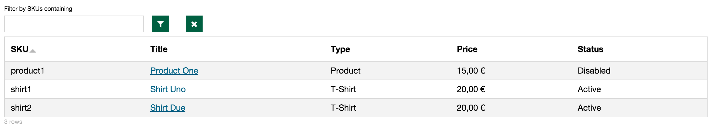](../img/development/customize/default_product_view.png)

Now we want to change it to to show our custom fields.
Todo so we go to: Structure » Views » ERPAL Products 

Here we can customize our view to our liking.
In our case we add the fields to the view as well as exposed filters to filter by those fields.

It now looks like this:
[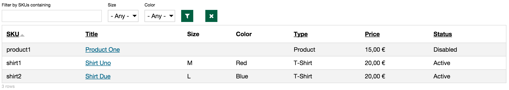](../img/development/customize/customized_product_view.png)

## The Export Process
Now we are ready to export our product type and our customized view.

### The Product
By default commerce entities are not exportable. 
To make product types exportable you need the [commerce features](https://www.drupal.org/project/commerce_features) module.
This enables you to export product types, line item types, tax types etc. 

So we are good to go and can add the product type to our feature:
[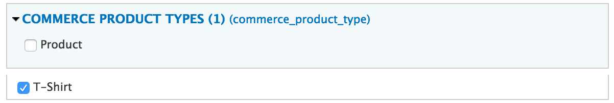](../img/development/customize/features_product_types.png)

### The View
Before we customize our view we can go to Structure » Unlink default configurations and open the 'Views' tab to see that the ERPAL view is in code and served from the erpal_commerce_ui module.
[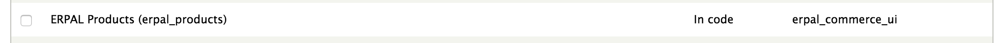](../img/development/customize/unlink_defaults_in_code.png)

When we want to add the customized view to our feature we realize that it doesn't show up:
[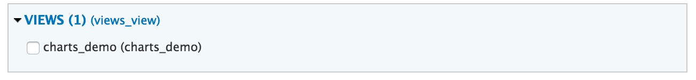](../img/development/customize/features_not_showing_customized_view.png)

So we head over to Unlink default configurations again and we can see that the view is now in the database, but it is still served from the erpal_commerce_ui module.
It is in the database because we customized it, but features won't let us export it because it initially comes from code.
[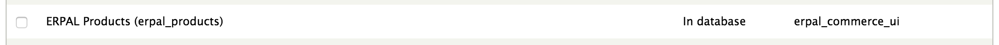](../img/development/customize/unlink_defaults_in_database.png)

We need to check the view to be unlinked and save the unlink settings by clicking the button 'Move selected configs to the database'.
Now the view is in the database and "not" served from a file anymore.
[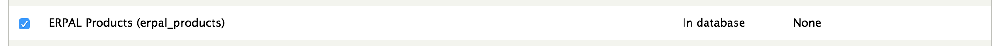](../img/development/customize/unlink_defaults_unlinked.png)

We can now add our customized view to the feature.
[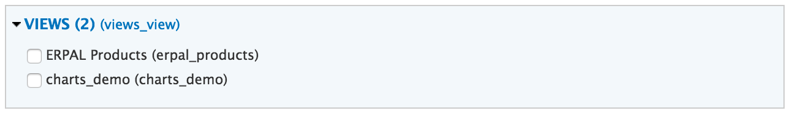](../img/development/customize/features_showing_customized_view.png)

But we also need to add the unlink defaults settings with [strongarm](https://www.drupal.org/project/strongarm) to our feature, so the site we deploy to knows that we serve our view from a different file than the original one.
[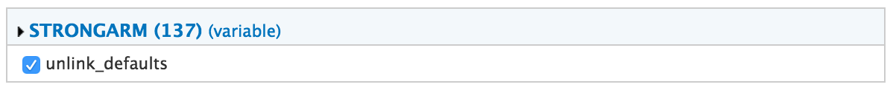](../img/development/customize/feature_unlink_defaults.png)
 
After we exported our view we can check on the unlink defaults page what happens.
The view is still shown to be in the database, because after editing it still is in the database, but it is shown to be served from our feature which is exactly what we were aiming for.
[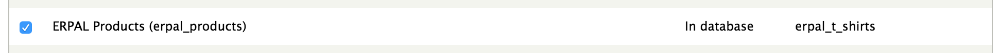](../img/development/customize/unlink_defaults_in_feature.png)

We can now revert the view or deploy our feature to another server to see that the view is served from code in our feature.

 
## The Summary
To export product types you need the [commerce features](https://www.drupal.org/project/commerce_features) module.
To export customized configuration to a feature that was served from a module you need the [unlink default configurations](https://www.drupal.org/project/unlink_defaults) module.
After unlinking configurations from their initial module you can export them to your own feature.
Todo so you need to add the unlink defaults configuration to the feature via [strongarm](https://www.drupal.org/project/strongarm).
