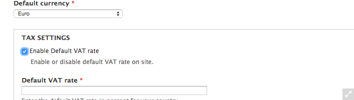
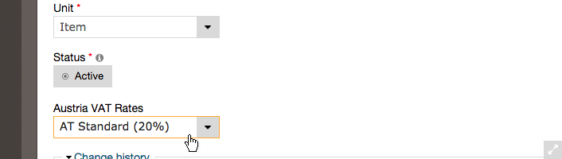
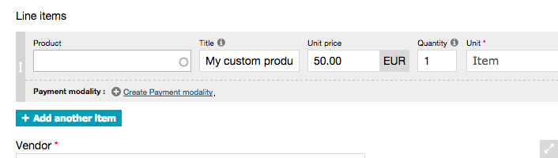

As some countries, especially in the EU, have different tax-classes for different type of products, we want to show 
you, how you can enable different tax-classes per product using the [commerce eu-vat module](https://www.drupal.org/project/commerce_eu_vat) (and disabling the currently used commerce_tax module).

Here we go.

## 1. Disable commerce_tax
Out with the old... since we want to use the "commerce_eu_vat" module there is no need for the "commerce_tax" module, 
that ERPAL platform uses by default, therefore you can disable it, preferably by using drush:
 `$ drush dis -y commerce_tax`.

## 2. Enable commerce_eu_vat
You can either download the module, put it into the designed folder `(sites/all/modules/contrib)` and enable it in the
 modules section of your ERPAL installation, or - as we all love drush - you can do it all in just one command:
 
    $ drush en -y commerce_eu_vat commerce_eu_vat_<country-shortname>
    
You just have to replace the `<country-shortname>` with the shortname of your choice e.g. `commerce_eu_vat_at` for 
austrian taxes or `commerce_eu_vat_pl` for the polish and so on.

If you are not sure which is the correct shortname, just use `$ drush en -y commerce_eu_vat` and check the modules 
page, there you can find the full country names to each available module.

## 3. Patching commerce_vat
The commerce_vat module is a dependency of the new commerce_eu_vat, but it (currently) needs a little fix to work as 
we want it to. Luckily the right patch is available and applying it is not a big thing to do.
 
See the issue details for more information about what the patch does: [https://www.drupal.org/node/2366943](https://www.drupal.org/node/2366943)

Patching may sound a bit scary at first, but it's actually just two steps given you are using git:

  1. download the patch-file and put it into the root-directory of your git repository
  1. apply the patch with this command: `$ git apply -v commerce_vat--rebase-price.patch`
  
For more details on how to apply patches have a look at [https://www.drupal.org/patch/apply](https://www.drupal
.org/patch/apply) when you are **using git** or [https://www.drupal.org/node/534548](https://www.drupal.org/node/534548) if you want to **apply a patch manually**.

    
Done? You're Awesome.

## 4. Disable the default vat-system
Next: navigate to ERPAL » ERPAL Settings » "Vendor settings" (/admin/erpal/settings/vendor) and disable the checkbox for "Enable Default VAT rate" - this will now be handled by the commerce eu-vat module.

## 5. Clear cache
Important step, without [clearing the cache](https://www.drupal.org/documentation/clearing-rebuilding-cache) you would not see much of a change. So again: drush to the rescue `$ drush cc all`.

## Finish!
And that's it already. Now you should be able to select the appropriate tax-class for your new or existing products -
 it should look something like this while editing a product:
 

## One more thing: Custom products
As disabling commerce_tax also disabled the use of a global tax-rate, there will be no tax applied to "custom 
products".

### What is a custom product?
Good question! While creating a quote, order or invoice you can add "custom products", line-items that **do not 
referenciate** an
existing product (aka leave the product field blank).

However this is not a recommended practice, but let's just say that there are some use-cases for it.
