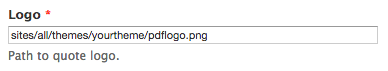
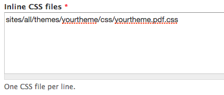
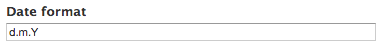

# Prerequisite
ERPAL Platform generates quotes, orders and invoices for you.
In general they include all the information needed, but by default they will not match your corporate identity.
But as flexible as ERPAL is this is easy to do.
If you want to customize the layout or the design there are enough options to get you to your goal.

In this article we show you how to add custom css and how to add a template to your subtheme.
So the first step is to add a custom subtheme which is explained section about [creating a sub-theme](subtheme.md).
We assume you already added a custom theme and continue with the actual customization.
Your theme needs to be enabled of course.

# Your Options

You have some options to customize your PDFs look.

1. [Adding your logo](#adding-your-logo)
3. [Adding a custom template via subtheme](#adding-a-custom-template-via-subtheme)
4. [Adding a custom template via hook_preprocess_entity](#adding-custom-theme-via-hook_preprocess)
2. [Adding custom css](#adding-custom-css)
5. [Changing the date format](#changing-the-date-format)

You can customizes qutes, orders and invices separately but the process is the same for all of them.
We will only focus on quotes here and only mention the other two if some other steps are different.

# Adding Your Logo
Now that you have a custom theme it is quite easy to change the logo on quotes.
You need to navigate to the PDF settings found at: _Quotes » PDF Settings_ or go directly to _/admin/commerce/config/quote/pdf_.

Here you can change the path to your logo.
It is recommended to place the logo in the module folder, you then need to enter the path to it like so: `sites/all/themes/yourtheme/pdflogo.png`.

And violà you have your logo in your quote.

# Adding a Custom Template via Subtheme
To customize the template of the quote goto `profiles/erpal_platform/modules/erpal/erpal_quote/modules/erpal_quote_ui/templates` and copy the file `commerce_order--order--order_pdf.tpl.php` to your theme.
The location for the invioce template is the same, just replace quote with invoice, for orders it is a bit different: `profiles/erpal_platform/modules/profile/erpal_commerce/modules/erpal_commerce_ui/templates` and copy the file `commerce_order--order--order_pdf.tpl.php` to your theme.

Now it is time to clear the cache.

Now you can customize your template as you wish.

## Adding Custom Theme via hook_preprocess
Just for completeness we want to mention that you could also add a custom template via `hook_preprocess_entity()` in a module.
But we recommend to do it via custom subtheme so we will not further explain it here.
If you really want to do it look for our `erpal_invoice_ui_preprocess_entity()` as an example.

# Adding Custom CSS
The process to adding custom CSS is quite similar as the process to add a custom logo.
On the same PDF settings page found at: _Quotes » PDF Settings_ or directly at _/admin/commerce/config/quote/pdf_ you will find a field "Inline CSS files" which needs the path to your custom css.

To get you started you can go to _sites/all/themes/erpal_theme/css/_ and copy the erpal-theme.pdf.css file to your theme. (We generated the file using compass so there might be some debug info left, feel free to remove that.)

You then enter the path like so: `sites/all/themes/yourtheme/css/yourtheme.pdf.css`

And now you can apply styles to your PDFs.

# Changing the date format
Changing the date format is quite easy and happens on the same `PDF Settings` page again. You just need to enter your desired format into the appropriate field.
The date is parsed with the PHP date() function, so the format you enter is the standard [php format](http://php.net/manual/en/function.date.php#refsect1-function.date-parameters).

# Conclusion
That's it you now have full control over the look and feel of your quotes, orders and invoices.
Now you know how to change the template, the logo, the css and the date format.