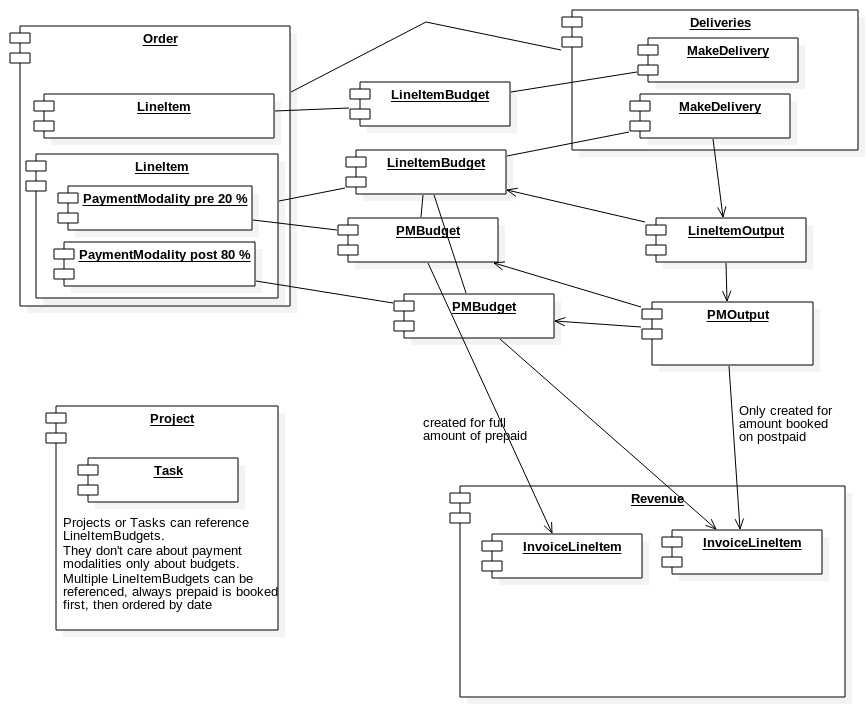

# Termdefinitions

In this chapter all special Terms are defined. When talking about the customer this means a) the customer in an online shop or b) the person adding stuff to a Quote/Order/Invoice(QOI) unless otherwise stated.

## Table of contents

[TOC]

## Roles used in this document

### ERPAL User
The person using ERPAL. For example an accountant creating invoice, a shop owner selling products, a developer working on projects

### ERPAL Admin
The person setting up ERPAL to be usable by the user. The admin can add product types, taxonomy terms, tax rates 
    etc.

### Self Customer
The person that buys stuff on his own from a webshop by going through the whole cart process. He will then interact with ERPAL/the shop himself. 

### External Customer
Something can be sold to him. In this case he will not interact with ERPAL himself, but only the ERPAL user who is in charge of the sales process.

## Product (bundle of entity product)

A standalone product, that can be a variation of a product display, (product dispalys are only needed if we are talking about an online-shop). Only products that are created by a user with the permission to create products can be sold. Every product has an sku to be uniquely identified. Products have fields:

- Attribute fields: Fields with defined list of options. Attribute fields are displayed as select boxes on the product display for the user to select the variation. For example a size field. You create a product with size M and a product with size L. Now in the shop viewing the product display the customer can choose in the select box from those two sizes to select the product he wants to buy. So this field can be “modified” by the customer. In ERPAL backend the user directly selects a specific product, so the field in the line item will be prefilled from this.

- Property fields: These fields are absolutely required for ERPAL (and commerce) to work. For more info see properties list of commerce products. Example: base price. But also fields that inform the user about the product, for example an image, that the customer can not modify.

There are products (for example: T-shirt, color: red, size: m, price: 15€, sku: t-shirt-red-m) and services (website maintenance 100€/h, sku: web_main). The main difference is in the [unit](#unit), usually services are paid by the hour and products by quantity of items.

### Unit
Products have a unit of measurement in which they will be delivered. Units can be for example Hour, day, month when selling a service, item on tshirts, liter on oil, volume on firewood and cm, meter on fabric. When possible the units will be converted, for example a product has a price per meter, but a customer only buys 10cm he actually buys 0,1 meter. ERPAL needs units on every product so it counts as a property field and is automatically added to a new product type on creation.

## Line item 
A line item is a piece of information on a Cart/[Quote]()/[Order]()/[Invoice]() (QOI). Each line item is something that is sold to the customer. A line item is created from a product at the moment the product is added to the QOI. A line item inherits the fields from a product, the unit in particular. For the user it seems that he added the product to the QOI but by creating a line item we persist the information of the product at the moment of adding. If a product is changed later it is very important that it must not change the line item in any way. The line items and QOI must support [audit-proof archiving]().

There are two possible ways to achieve persisting information.

- **Method 1: Copying all information from the product to the line item on creation.** This would imply for example color, size and price fields need to be created on the product and on the line item.

- **Method 2: Locking the product once a line item is created.** Once a line item is created it is not allowed to edit the product anymore. The line item always retrieves it's attributes like size, color, price from the locked product.

We prefer and implement **method 1** as this is the more common and safer way.

A line item needs to know about it's base price, [tax]() and amount to calculate it's total price. But also discounts on products need to be able to influence the price. To achieve this a price consists of multiple price components.

A line item can only be referenced in one QOI but QOIs can have multiple line items. A classic 1:M relation. Since QOIs often need to list all line items it is more performant to have a multi reference field on QOIs. It must be possible to check if a line item is referenced in an invoice to list not billed line items (see [revenue]()).

An invoice-line-item is created from a payment modality in an order. For each prepaid payment modality (“due with order”) an invoice-line-item is created on order save. For postpaid (“due with delivery”) payment modalities an invoice-line-item is created when the button “deliver” is clicked or a task status is set to “delivered”.

###  Customizable Line Items
We can offer products that are customizable by the customer. For example a t-shirt where the customer can enter a word that will be printed on the t-shirt, a Gift box where the customer can chose two products placed in the gift box. This information is entered in the “add to cart” form. Once added to the cart the information is saved on the line item, not on the product. So there need to be fields to enter and save the custom information on the line items. This must not be serialized information, for each customization there needs to be a separate field.

###  Payment modality
A payment modality is saved on each line item and describes how much has to be paid when for this payment modality. This is saved on each line item. By default line items have to be paid 100% “on delivery” (postpaid), but it is possible to set payment modalities to “on order” (prepaid). Multiple payment modalities can be created for a single line item. For example „20% on order and 80% on delivery“. Speaking in projects, a payment modality can represent a billable milestones (also called deliveries), speaking in products this can be the different shippings if not all products can be shipped together. And also for a t-shirt we can have a first prepayment due with the order and another payment the t-shirt is received.

###  Keeping overview of deliveries and payment modalities
Every line item has a line-item-budget that keeps track of how much has to be and how much has been delivered in total (e.g. 10 of 50 hours or 2 of 10 t-shirts have been delivered). For each payment modality an extra payment-modality-budget is created to keep track of how much of each payment modality is left. This does not influence the line-item-budget. Payment-modality-budgets, line-item-budget and line item use the same unit.

Once a delivery (output entity) is created with the correct unit for a line item its amount is added to the line-item-budget to keep track of the total deliveries. If multiple payment modalities exist the delivery will be added to one or more payment-modality-budgets as well. First to the prepaid budgets and then to the postpaid budgets. If, while adding the delivery amount to the budget, the budget reaches 100% the rest of the delivery will be added to the next payment-modality-budget in line. The delivery keeps track of which budgets it is has been added to. If the delivery is changed all concerning payment-modality- and line-item-budgets will be adjusted accordingly.

| Time | Delivery | Line-item-budget | Prepaid-budget | Postpaid-budget |
|------|---------:|-----------------:|---------------:|----------------:|
| 0    |        0 |          0 / 100 |         0 / 20 |          0 / 80 |
| 1    |        5 |          5 / 100 |         5 / 20 |          0 / 80 |
| 2    |       30 |         35 / 100 |        20 / 20 |         15 / 80 |
| 3    |      -20 |         15 / 100 |        15 / 20 |          0 / 80 |
| 4    |       85 |        100 / 100 |        20 / 20 |         80 / 80 |
| 5    |      -20 |         80 / 100 |        20 / 20 |         60 / 80 |

##  Deliveries
 A Tab “deliveries” is added to the order. It shows all line-item-budgets. Each budgets has a quantity field and a “deliver” button. The quantity field is prefilled with the available amount of the budget. When the button is clicked a delivery with the according quantity is created and added to the budgets as described as above. Also an invoice-line-item is created for the amount that is booked on a postpaid line-item-budget. A bulk operation can be used to deliver multiple line items (products) at the same time. (Bulk operation is not BETA)
 
 All line-item-budgets  show the deliveries (outputs) added to them. This could be in an extra table row that is only shown on a click on the “more info” button.
 
 An extra page, shows a list that shows everything that needs to be delivered, similar to the revenue line item list. (not BETA)

##  Revenue
A revenue is a billable business activity (such as a delivered milestone, a tracked time on a time based project etc) that has not been billed yet. We use line items to model this unit and each of these line items reference their originating order. But since it has been ordered it can be calculated with in the business activities and reports. Prepaid products also create a revenue represented by a line item. From this line item an invoice can be created. If a line item is included in an invoice, it cannot be invoiced or changed anymore automatically. If it is not included in an invoice but a related output entity (e.g. time tracking) was modified, the related line item will be modified and adjusted.
   
   
   
## Quote
Commercial statement listing a set of products and services (in our case line items) to be purchased by the customer from shop owner for a defined price. Once the quote is created the price of the line items must not change automatically anymore ([audit-proof]()). This should only happen manually by an authorized users. When adding products to the quote a line item is created and the information from the product is copied from the product to the line item.
   
   
   
## Order
Instruction from a customer to buy something from the shop owner. “Something” is exactly defined by the related quote. In general the order behaves like the quote, it just represents a different state the sales process and starts a business. There are two ways to create an order

- from a quote
- from scratch

When creating an order from a quote all information from the quote is copied (duplicated, not referenced) to achieve [audit-proofness](). This includes the line items, the quote creates new line items and copies all information from each quote line item. Once the order is created it should reference the quote and the quote status should be set to “ordered” which prevents the quote to be edited.

When creating an order from scratch it behaves like a quote, products can be “added” by creating line items and copying the information from the products to the line items.

Once the status on the order is set to “accepted by customer” it should not be editable anymore as it serves as a contract documenting the agreement  of purchase ([audit-proof]()).

Quotes and orders (and invoices as well) have different numbers such as quote number, order number and invoice number. These numbers will be generated automatically.

##  Invoice
The invoice most of the times is the last step in the sales process. It is a commercial document serving as an accounting voucher (to verify price, tax etc.). In general the invoice behaves like the order, it just represents a different state in the sales process. The invoices requests the customer to pay the value of products and services that have been delivered as agreed on in the order or have to be prepaid according to the payment modalities of the quote. Again there are the two ways of creating an invoice, from an order or from scratch. If the order has for example multiple milestones (payment modalities of type “due with delivery”) they should be billed separately so multiple invoices can be created from this order. One for each milestone but also multiple for each payment modality. If we have a unit “hour” we can create a monthly invoice that is related to one order with one line item and one payment modality. This is the main reason why QOIs need to be different entities and not a single entity with a status “QOI” as it is implemented in commerce kickstart for example. But invoices also need extra fields like credit period and skonto (not BETA) (early payment discount)

## Taxes
Since the tax can vary on the customers location the tax is applied to the line item, not the product.
But the product needs to know which kind of tax is applied to it for each country. For example in Germany there is a reduced tax for books and food etc. and a standard tax for pretty much everything else. It's quite similar in England, but they have even more tax rates. This means the tax depends on the country and the product type where the vendor is situated but also to the country where the customer is situated (or where the product is delivered to, I am not sure for 100% TODO). When the tax is applied (display in store front or QOI) it depends on the customers country and the product type, so the product needs to tell the tax rules which tax to apply. Anyway these rules need to be respected as they vary in each country. It should be possible to calculate automatically (store front) but also to let the user select the tax directly in the line item (backend for QOI).

Entering the correct tax rates for each country on each product is the responsibility of the user editing the products.
