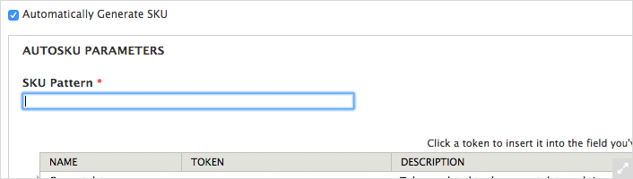

In this demo we want to show you how you can create an onlineshop with [commerce store](https://drupalcommerce.org/) on the frontend and ERPAL platform on the backend, without much effort.
Please be aware that these are only some steps towards creating a ready-to-go-live online-shop. Creating taxes, or syncing customer profiles to CRM contacts for example are not covered in this tutorial.

We also prepared some timestamps, so that you can retrace your steps by skipping through the screenscast. Keep an eye open for them » (<a class="seekto">0:04</a>).

Before we start: special thanks to [spleshka](https://www.drupal.org/u/spleshka) for creating the screencast.

## The Video

**Please note** that, due to advancement in development, there are additional steps required, that are **not** mentioned in the video:

- [enable Dynamic widget for commerce line item use for cart](#preparation)
- [5.2.1. Set default site template selection rule](#5.2.1-set-default-site-template-selection-rule)

## Preparation
For the online-shop we will need some additional modules that are not shipped with ERPAL Platform, so please download & 
enable:

- Modules
    - [Commerce AutoSKU](https://www.drupal.org/project/commerce_autosku) (commerce_autosku)
    - Views UI (views_ui)
    - Cart (commerce_cart)
    - ERPAL Commerce Cart (erpal_commerce_cart)
    - ERPAL Quote Commerce Cart (erpal_quote_commerce_cart)
    - Payment Method Example (commerce_payment_example) [for demo/testing]
    - [ThemeKey](https://www.drupal.org/project/themekey) (themekey)
    - ThemeKey UI (themekey_ui)
    - **[not in video]** Dynamic widget for commerce line item use for cart (commerce_line_item_widget_cart)
- Themes
    - [Adaptive Theme](https://www.drupal.org/project/adaptivetheme) (adaptivetheme)
    - [AT Commerce](https://www.drupal.org/project/at_commerce) (at_commerce)

All in one go using drush:

    drush en -y commerce_autosku views_ui commerce_cart erpal_commerce_cart erpal_quote_commerce_cart commerce_payment_example themekey themekey_ui commerce_line_item_widget_cart adaptivetheme at_commerce

## 1. Add Product Display
For the start we will add the a new content type, that will be used to create the product that we want to sell (<a class="seekto">0:40</a>).

1. Go to: Structure » Content types » Add content type (/admin/structure/types/add)
1. Name: 'Office Supplies'
1. Save & add fields
1. Manage Fields: (<a class="seekto">0:53</a>)
    - Delete: body
    - Add image
        1. Label: "Image"
        1. Machine name (rename to): "field_office_supplies_image"
        1. Field type: `Image`
        1. Save
        1. Save field settings (no changes here)
        1. Check `required field`
        1. Save settings
    - Add product reference
        1. Label: "Product"
        1. Machine name (rename to): "field_office_supplies_product"
        1. Field type: Product reference
        1. Widget: `inline entity form - single value` or `inline entity form - multiple values`
        1. Save
        1. Save field settings (no changes here)
        1. Check `required field`
        1. Save settings

## 2. Configure Product
Next up: configure the product to use an automatically generated sku (<a class="seekto">1:53</a>).

1. Go to: Store » Products » Product types » Product (/admin/commerce/products/types/product)
1. Enable `Automatically Generate SKU`
1. Set `Pattern` to "[commerce-product:title]" (Products » Title)
1. Save product type

## 3. Add Products
This step is a rather easy one: add some products (<a class="seekto">2:16</a>).
You can do that on Content » Add content » Office Supplies.

## 4. Create Products-list (view)
The fourth step: creating a product-list (view and page), is not that complicated but rather complex. So let's do this step by step. (<a class="seekto">3:10</a>)

### 4.1 Add a new view
First part: create a view that contains all listed products (<a class="seekto">3:27</a>).

1. Go to: Structure » Views » Add new View (/admin/structure/views/add)
    - View Name: "Shop: Product list"
    - Show `content` of type `Office Supplies` sorted by `newest first`
    - Uncheck `create a page`
1. Continue & edit
1. Config (<a class="seekto">3:47</a>)
    - Format: table
    - Fields » Add: `Content Image`; Image style: `Thumbnail`
    - (Advanced) Relationships » Add
        - Check `Content: referenced products`
        - Add and configure relationships
        - Identifier (rename to) "Product"
        - Check "require this relationship"
        - Apply
    - Fields » Add: `Commerce Product: Add to Cart form`; check `Display a textfield quantity widget on the add to cart form`; check `Attempt to take settings from line item field widget.`; Select from which order type the line item settings should be taken.
    - Fields `Content: Title` » `Create a label` set to "Product"
    - Displays » Add » Content pane
        - Set Display name to "Shop: all products"
1. Save

### 4.2 Add a new page
Second part: adding a new page that will show our just created view (<a class="seekto">6:10</a>).

1. Go to: Structure » Pages » Add custom page (/admin/structure/pages/add)
1. Basic setup
    - Set `Administrative title` to "Front page"
    - Set `Path` to "front"
    - Check `Make this your site home page`
1. Continue
1. Choose Layout
    - Select `Category` "Columns: 2"
    - Select "Two column"
1. Continue
1. Continue (no changes to the Panel settings)
1. Panel Content (<a class="seekto">6:36</a>)
    - Set `Title type` to "No title" 
    - Left side: Add content » Menus » "User menu"
    - Right side: Add content » View panes » "View: Shop: Product list: Shop: all products"
1. Finish
1. Save

## 5. Improvements
OK, the most important part, showing the products, is done. So let's add all the little things an online-shop needs, 
like an option to (re-) download the invoices, or a separated theme for the shop and backend (<a class="seekto">7:11</a>).

### 5.1 Set shop-theme as default
Let's set a new shop theme so that a (potential) customer will see your favorite funky theme, but keep the ERPAL 
theme for adinistrative parts.

1. Go to Appearence (/admin/appearance)
1. Enable AT Commerce theme and set as default

### 5.2 Set ERPAL theme for administrators
First here comes a new part: we progressed with our development, thus you would need to go a little detour by 
adjusting the default site template setup - won't take long. promise.

Then we'll make our beloved ERPAL theme again available for the admins.

1. **[not in the video]** Set default site template selection rule
    1. Go to: Structure » Sites » Edit site template (/admin/structure/pages/site_template)
    1. Open ERPAL default » Selection rules
    1. Add "Current theme"
        - Set `Themes` to "ERPAL Theme"
    1. Update and save
1. Add User role (<a class="seekto">8:20</a>)
    1. Go to: People » Permissions » Roles (/admin/people/permissions/roles)
    1. Add role: "administrator"
    1. Assign rule to your user
1. Set ERPAL Theme for Admins (<a class="seekto">8:45</a>)
    1. Go to: Configuration » User interface » ThemeKey (/admin/config/user-interface/themekey)
    1. Add new rule
        - Set `user:role` = "administrator"
        - Set `Theme` to "ERPAL Theme"

### 5.3 Miscellaneous
As we still want to be able the access the given dashboard-page will add a new link to the ERPAL menu. Once this is 
done we will add our shop-logo to the theme and add permissions that users may access the new products, the 
cart-checkout or download their quotes (<a class="seekto">9:15</a>).

1. Add a link "Dashboard" to ERPAL Menu with path: "home"
1. Create demo user
1. Add logo to AT Commerce Theme (<a class="seekto">9:59</a>)
    1. Go to: Appearance » Settings » AT Commerce Theme (/admin/appearance/settings/at_commerce)
    1. Scroll to `Logo image settings`
    1. Uncheck `Use the default logo`
    1. Save configuration
1. Permissions (<a class="seekto">11:00</a>)
    1. Go to: People » Permissions (/admin/people/permissions)
    1. To view products, add permissions:
        - `View published content` for anonymous and authenticated user
        - `View any product of any type` for anonymous and authenticated user
    1. To enable checkout button, add permission:
        - `Access checkout` for authenticated user
    1. To enable to download own quotes, add permission:
        - `View own orders of any type` for authenticated user
        
### 5.4 Create a quotes, orders and invoices page
Next one is a bit more complicated but still easy to retrace: we will create a new view that will give a logged-in 
user the chance to view his/her quotes, orders and invoices (<a class="seekto">13:54</a>).

1. Add new view
    1. Go to: Structure » Views » Add new View (/admin/structure/views/add)
        - Show `Commerce Order` of type `Order`
        - Uncheck `Create a page`
    1. Continue & edit
    1. Config (<a class="seekto">14:15</a>)
        - (Advanced) Add contextual filter
            1. Check `Commerce Order: Uid`
            1. Set `When the filter value is not available` to "Display contents of 'No results found'"
            1. At `When the filter value is available or default is provided` check "Specify validation criteria"
                - Set `Validator` to "User"
            1. Apply
        - Set `Format` to "Table"
        - Add field `Commerce Order: Order PDF`
        - Remove field `Commerce Order: Order ID`
        - Add quotes-pdf-link
            1. Add relationship
                - Check `Entity Reference: Referenced Entity` for "field_quote"
                - Rename Identifier to "Quote"
            1. Add field
                - Check `Commerce Order: Quote PDF`
                - Select relationship "Quote"
        - Add invoice-pdf-link
            1. Add relationship
                - Check `entity reference: referencing entity` for "field_invoice_order"
                - Rename Identifier to "Invoice"
            1. Add field
                - Check `Commerce Order: Invoice PDF`
                - Select relationship "Invoice"
        - Add content plane (<a class="seekto">17:15</a>)
            1. (Pane settings) Argument input
                - Set `Commerce Order: Uid source` to "From context"
                - Set `Required context` to "User ID" (Group User)
            1. Change display name to "My orders"
    1. Save
1. Create new custom page (<a class="seekto">17:47</a>)
    1. Go to: Structure » Pages » Add custom page (/admin/structure/pages/add)
    1. Basic setup
        - Set `Title`to "My orders"
        - Set `Path` to "my-orders"
        - Check `Contexts`
    1. Contexts
        1. Add contexts
        1. Select `User`
        1. Set `Enter the context type` to "Logged in user"
    1. Panel content
        1. Add Content View panes » View: My orders
1. Add a links to User-menu
    - Add "My orders" with path: "my-orders"
    - Add "My cart" with path: "cart"
    
### 5.5 Change checkout completion message
Finally we want to show you how you can customize the completion-message, for example by adding a link to the new order-view-page (<a class="seekto">20:16</a>).

1. Go to: Store » Configuration » (/admin/commerce/config/checkout)
1. Configure "Completion message" and adjust the message

## Summary
That was quiet the journey but you made it, awesome. That means you are now fit to open up your own online-shop powered by EPRAL platform.

So, we have shown you how to create pages to provide a user access to their orders on the fly as well as customizing important parts of the checkout-process and - of course - the basic shop itself can be created. And all that in just about 20 minutes! Isn't that amazing?
